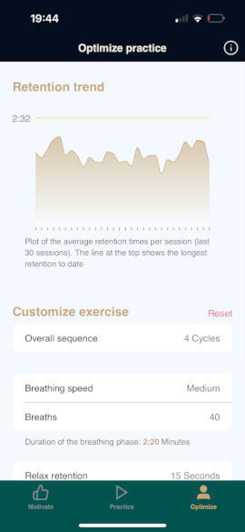
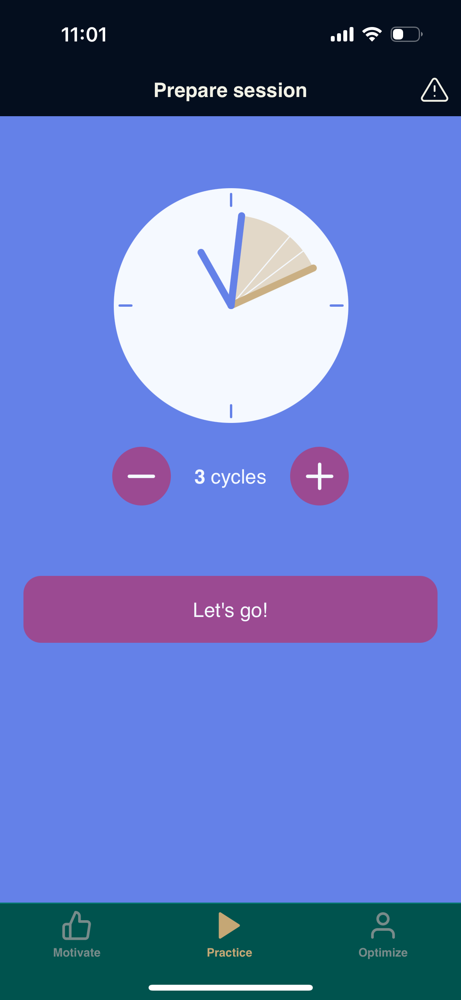
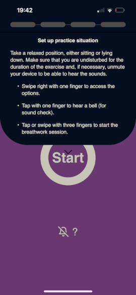

# Phoon

Breathwork app inspired by the [Wim Hof Method](https://www.wimhofmethod.com/). Optimized for being used "blindly": do your breathwork completely relaxed lying down with eyes closed - `Phoon` guides you with sounds and is operated with simple touch gestures. Focus on your breathing only!

## Overview

`Phoon` is a free and open-source app that supports you in establishing a habit of regular Wim Hof style breathwork exercise:

&nbsp;&nbsp;&nbsp;&nbsp;&nbsp;&nbsp;&nbsp;

- **Find and maintain your motivation** for regular practice: You set a goal of how often you want to exercise - `Phoon` keeps track of your streak and makes sure you don't miss a beat. By exercising you earn rings protecting your streak: for each ring you have, you can take a day off whenever you like. How often you get new rings depends on your practice goal (e.g. "4 times a week").
  

- **Practice conveniently however you like**: For example, load `Phoon` on your smartphone and do your breathwork exercise totally relaxed lying down with closed eyes - `Phoon` guides you with sounds and when you have to trigger the next step (e.g. to indicate the end of your breath hold (retention)), you can do that with a simple touch gesture. 
You prefer being guided visually? `Phoon` provides animations ("breathing bubble") and color-coded phases so you are always oriented!

- **Optimize your breathwork success**: fine-tune your exercise parameters and keep track of your retention time progress. `Phoon` provides a graph of the mean retention (breath hold) time of your last 30 sessions so you can retrace how your retention capacity develops. Tinker with your exercise parameters (such as _nummber of cycles per session_, _breathing speed_ or _number of breaths_) to find the setup that works best for you!

## Try Phoon

Just go to [phoon.bendilobi.de](https://phoon.bendilobi.de)

For optimal experience, go there using your smartphone's browser (Safari on iOS; Chrome on Android) and put a link to the site on your phone's home screen. When started from there it will look and behave like a native app from the App Store / Play Store!

## Other Features

 
&nbsp;&nbsp;&nbsp;&nbsp;&nbsp;&nbsp;&nbsp;

- Unsure whether you have enough time to do your morning exercise before leaving for work? `Phoon` estimates at which time you will be done so you know at a glance if you can do it.
- Not enough time to do a full exercise? Quickly adjust the number of cycles before starting your session without changing your general exercise preferences.
- Keeps track of your current streak, last streak and longest streak so far
- Remembers your longest retention time
- Supports multiple languages (currently English and German)
- Touch gestures are designed so that you don't accidentally trigger stuff if you pick up your phone:
  - Go to the next exercise step by tapping or swiping with three fingers at once
  - Display options by swiping from left to right all over the screen
  - Display information on each exercise step by pulling down
- Keyboard shortcuts to operate `Phoon` on devices without touchscreen
  - Go next by pressing `Space`
  - Show options by pressing `Esc`
  - Show the information drop-down by holding the `Arrow-down`key
- Your data is yours and yours alone: `Phoon` does not send any data anywhere; everything stays on your device.
- Data export: You can export your retention and streak data in JSON format by coping it into your device's clipboard. Then paste it into any other app for backup etc.

## Phoon Development

`Phoon` is a Progressive Web Application (PWA) implemented in [Elm](https://www.elm-lang.org) using the [Elm Land](https://elm.land) framework. 

Currently, the app is extensively tested only on my iPhone 15 with recent iOS versions and within Chromium on Linux as I don't have access to other devices. 

Please don't hesitate to report any issues you find to help broaden the scope of devices it runs well on! Pull requests are welcome, too!

If you like `Phoon` and want to support me developing it further, you can [buy me a coffee](https://buymeacoffee.com/bendilobi)! That would be nice 🙂!

### Planned Upcoming Features

- **Zen mode**: No text or numbers so your conceptual mind isn't triggered when using the app
- **Better support for Android**: adjust look and feel when run on Android devices
- **More details in the retention graph**: Show streaks, breathing time etc.
- **Better accessibility**: Text zoom, ...
- _Your feature idea_: Please describe it in an issue here in this repository!

